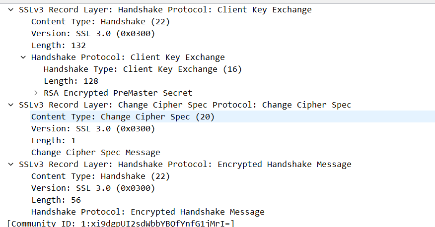

# 1
```
01. client  Client hello
02. server  Server herllo
03. sever   Certificate,Server hello done
04. client  Client key exchange ,change chiper spec,encrypted handshake message
05. server  change chiper spec,encrypted handshake message
06. client  application data
07. client  application data
08. client  application data
```
# 2
```
content type: 1byte
version: 2byte
length:2byte
```
# 3
图片::
```
无content type
```
# 4
```
yes, the 0x0010
```
# 5
```
hash algo:Cipher Spec: WITH_RC4_128_MD5
public key algo:TLS_RSA
symmetric key algo:SSL2_RC4
```
# 6
```
public key algo
```

图片:
# 7
```
无
```
# 8
```
yes,服务器可以在会话中查找匹配
```
# 9
```
没有证书
```

图片:
# 10
```
加密了，给public key加密，length:128 bytes
```

图片:
# 11
```
让实体知道生成了密钥，进行加密通话
length :6bytes
```
# 12
```
通话
用密钥加密的
```
# 13
```
服务器明文发送的 change chiper sepc
```

图片:
# 14
```
数据是通过对称加密，包含了MAC信息，wireshark不能分辨数据和MAC。
```
